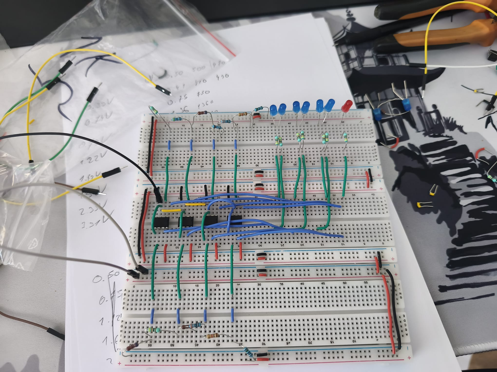
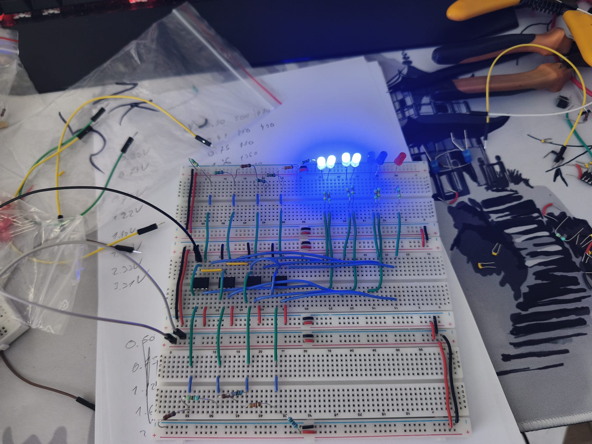
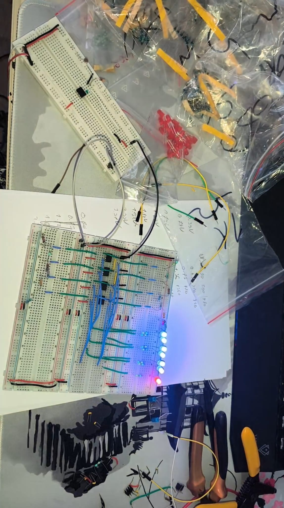

# P22 VU-meter analogic de lumină cu 7 LED-uri logaritmic

## Descriere proiect

VU-meter analogic de lumină construit cu 7 LED-uri, amplificatoare operaționale LM358, divizor de tensiune pentru a seta pragurile fixe și fotorezistor pentru a detecta nivelul de lumină din cameră. 0 LED-uri aprinse înseamnă întuneric total, iar toate LED-urile aprinse înseamnă lumină puternică (de la blitz).

## Componente folosite

- 1 × Fotorezistor (LDR)
- 5 × LM358 op-amp (1 buffer + 4 pentru cele 8 comparatoare)
- 7 × LED (6 albastre, 1 roșu)
- 4 × breadboard
- Fire solid-core 22 AWG

### Rezistoare

| Valoare | Cantitate |
|---------|-----------|
| 10 kΩ   | 1         |
| 1.8 kΩ  | 2         |
| 1 kΩ    | 3         |
| 680 Ω   | 2         |
| 470 Ω   | 3         |
| 430 Ω   | 1         |
| 330 Ω   | 7         |
| 150 Ω   | 1         |
| 100 Ω   | 1         |

## Arhitectura circuitului

### Etaj 1 — Senzor + buffer

**Componente:**
- 1 × 10 kΩ (R_fix)
- 1 × Fotorezistor
- 1 × LM358 (voltage follower)

#### Cum funcționează

Fotorezistorul își schimbă rezistența în funcție de lumina din cameră. Punând în serie un alt rezistor (R_fix) între LDR și GND, formăm la nodul de conectare dintre cele două un divizor de tensiune cu formula:

`V_out = V_in × R_fix / (R_LDR + R_fix)`

Când LDR-ul este în lumină puternică și are o rezistență de aproximativ 1 kΩ, formula devine apropiată de `V_in × R_fix / R_fix`, adică V_out se apropie de V_in. Când este în întuneric, R_LDR poate ajunge la sute de kΩ sau milioane de Ω, iar diferența dintre R_fix și (R_fix + R_LDR) este atât de mare încât output-ul divizorului este foarte mic.

Buffer-ul LM358 (voltage follower) izolează divizorul LDR de etajul de comparatoare, eliminând loading effect-ul.

### Etaj 2 — Generator de praguri

Pragurile sunt distribuite pe **două lanțuri paralele** între +5V și GND, pentru organizare vizuală pe breadboard (LED-urile cu praguri impare pe stânga, cele cu praguri pare pe dreapta).

#### Lanțul stânga (praguri 1, 3, 5, 7)

| Componentă | Valoare         |
|------------|-----------------|
| R_bot      | 470 Ω           |
| R_1        | 430 Ω           |
| R_2        | 680 Ω           |
| R_3        | 1 kΩ + 330 Ω    |
| R_top      | 1.8 kΩ + 150 Ω  |

| Prag | Tensiune |
|------|----------|
| 1    | 0.50 V   |
| 3    | 0.91 V   |
| 5    | 1.66 V   |
| 7    | 3.02 V   |

#### Lanțul dreapta (praguri 2, 4, 6, 8)

| Componentă | Valoare        |
|------------|----------------|
| R_bot      | 680 Ω          |
| R_1        | 470 Ω + 100 Ω  |
| R_2        | 1 kΩ           |
| R_3        | 1.8 kΩ         |
| R_top      | 1 kΩ           |

| Prag | Tensiune | Observații   |
|------|----------|--------------|
| 2    | 0.675 V  |              |
| 4    | 1.23 V   |              |
| 6    | 2.24 V   |              |
| 8    | 4.00 V   | LED eliminat |

### Etaj 3 — Comparatoare cu op-amp

#### Funcționalitate

Am legat pragurile stabilite la intrarea inversoare (V−) a fiecărui op-amp, iar la intrarea neinversoare (V+) am legat output-ul buffer-ului. Astfel:

- Când **V_buffer < V_prag** (V+ < V−), output-ul op-amp-ului este aproape de 0V → LED stins. Nu este destulă lumină pentru a depăși pragul.
- Când **V_buffer > V_prag** (V+ > V−), output-ul op-amp-ului ajunge aproape de Vcc → LED aprins.

### Etaj 4 — LED-uri

7 LED-uri conectate la output-ul fiecărui op-amp printr-o rezistență de **330 Ω**, cu catodul la GND.

## Calcule

### Pragurile logaritmice

Distribuție logaritmică între V_min = 0.5V și V_max = 4V cu factor multiplicativ k = 1.35.

**Formula:** `k = (V_max / V_min)^(1/n)` unde n = 7 (8 praguri = 7 intervale).

### Divizorul LDR

#### Teoretic

| Condiție | Tensiune |
|----------|----------|
| V_max (lumină) | 4.55 V |
| V_min (întuneric) | 0.45 V |

#### Măsurat

| Condiție | Tensiune |
|----------|----------|
| V_max (blitz) | 4.40 V |
| V_min (mâna pe LDR) | 0.30 V |

### Lanțurile de praguri

#### Lanțul stânga

| Prag | Țintă   | Real    | Eroare |
|------|---------|---------|--------|
| 1    | 0.500 V | 0.484 V | −3.2%  |
| 3    | 0.910 V | 0.926 V | +1.8%  |
| 5    | 1.660 V | 1.626 V | −2.0%  |
| 7    | 3.020 V | 2.994 V | −0.9%  |

#### Lanțul dreapta

| Prag | Țintă   | Real    | Eroare |
|------|---------|---------|--------|
| 2    | 0.675 V | 0.673 V | −0.3%  |
| 4    | 1.230 V | 1.238 V | +0.6%  |
| 6    | 2.240 V | 2.228 V | −0.5%  |
| 8    | 4.000 V | 4.010 V | +0.2%  |

Toate erorile sub ±5%.

## Măsurători funcționale

| Stare              | V_semnal | LED-uri aprinse |
|--------------------|----------|-----------------|
| Întuneric          | 0.30 V   | 0               |
| Lumină ambientală  | 1.40 V   | 4               |
| Blitz              | 4.40 V   | 7               |

## Probleme întâlnite

- Prima dată am vrut să folosesc BC547 pe post de comparator, dar pragurile superioare deveneau inaccesibile din cauza căderii de tensiune V_be (~0.6V) plus V_ce(sat). La 5V alimentare, pragul maxim accesibil era ~2.3V, sub pragul 8 (4V).
- Am schimbat pe op-amp-uri LM358 deoarece au impedanță mare la intrare (fără loading effect) și nu introduc V_be în lanțul de tensiune.

## Ce am învățat

- Op-amp ca comparator (configurație non-inverting)
- Voltage follower / buffer
- Loading effect și input bias current
- Distribuție logaritmică de praguri
- Maparea valorilor teoretice la stocul real de rezistoare cu erori sub 5%

## Foto

